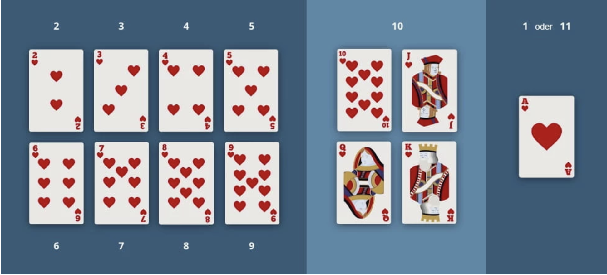

<h1 align="center">Grundlagen der Programmierung</h1>
<h3 align="center">Schleifen</h3>
 

  

 <b> Beschreibung </b> 

Willkommen zurück zu den Übungen an Tag 25. Heute wiederholen wir alles, was wir diese Woche gelernt haben.

Aber damit es uns nicht langweilig wird, werden wir die heutigen Aufgaben wieder in ein größeres Projekt packen.
Wir wollten vor 2 Wochen mit unseren Freund/innen Karten spielen.
Heute hat leider niemand Zeit mit uns Karten zu spielen.
Ab macht nichts! Wir programmieren uns unser eigenens Spiel!

Heute gibt es eine Runde Black Jack!

 <b> Black Jack Regeln </b> 

<h3 align="center">Black Jack Regeln</h3>
 

Hier erstmal die Regeln mit denen wir spielen werden:

Beim Blackjack spielt man gegen den Dealer. Bei uns wird der Dealer von unserem Programm gespielt.
Das Ziel des Spiels besteht darin, den Dealer zu schlagen.
Dafür müsst ihr mit zwei oder mehr Spielkarten näher an 21 Punkte kommen als der Dealer.
Habt ihr den gleichen Wert wie der Dealer ist es ein Unentschieden.
Weist eure Hand am Ende einen höheren Wert als 21 auf, habt ihr verloren.
Ebenfalls wenn ihr weniger Punkte als der Dealer habt.

Beim BlackJack spielt man um Geld, das heißt wir müssen vor jeder Runde Geld einsetzen.
Entweder verlieren wir es oder wir verdoppeln unseren Einsatz.
Bei unentschieden bekommen wir unser Geld wieder.

<b>Jede Runde sieht wie folgt aus:</b>

Zuerst bekommt der/die Spieler/in und der Dealer zwei Karten.
Der/die Spieler/in sieht dabei nur eine Karte des Dealers, die andere ist verdeckt.
Der/die Spieler/in darf solange immer wieder eine Karte ziehen, bis er nicht mehr will, oder verloren hat.
Kommt der/die Spieler/in über 21 hat er/sie verloren und der Dealer muss nicht mehr ziehen.
Sobald der/die Spieler/in zufrieden ist und nicht über 21 Punkte hat wird die Hand des Dealers aufgedeckt.
Nun muss der Dealer solange Karten ziehen bis seine Hand mindestens den Wert 17 hat.

<b>Wer hat gewonnen?</b>

Der/die Spieler/in hat gewonnen, wenn er/sie einen höheren Kartenwert als der Dealer hat.
Der/die Spieler/in hat direkt gewonnen wenn er/sie mit den ersten beiden Karten auf 21 kommt.
Kommt der Dealer über 21 hat der/die Spielerin gewonnen.

<b>Die Kartenwerte:</b>
Bei Black Jack müsst ihr euch nicht um die Farben kümmern, es Zählen nur die Zahlen.
Dabei gilt, das jede Zahl auf der Karte auch den Wert hat.
Also eine Herz 2 bringt 2 Punkte, eine Herz 3 bringt 3 Punkte, usw.
Bube, Dame und König bringen 10 Punkte und das Ass bringt manchmal einen Punkt und manchmal 11.
Ihr sehr es auch nochmal auf dem Bild unten.

  

<h3 align="center">Aufgaben</h3>
 

 <b> Aufgabe 1 - Das Kartendeck </b> 

Heute programmieren wir eine vereinfachte Version des beliebten amerikanischen Spiels “Black Jack”. Wir haben euch 
bereits einige Funktionen zur Verfügung gestellt, die euch dabei helfen werden.
Ladet euch also zuerst das Projekt “Tag25 Aufgaben” aus dem Google Classroom herunter und macht euch damit vertraut:
In diesem Projekt arbeiten wir heute unter src/main/kotlin  mit der Datei “KartenSpielen.kt”.

Wir stellen euch folgende 3 Funktionen zur Verfügung:

<b>mischen():</b> Diese Funktion erwartet ein Deck als MutableListe.
Es mischt dieses durch.

<b>karteZiehen():</b> Diese Funktion erwartet ein Deck als Mutable Liste.
Es zieht die oberste Karte des Decks und gibt die Karte als Rückgabewert wieder.

<b>kartenWert():</b> Diese Funktion erwartet eine Karte als String.
Sie berechnet den Wert der Karte in BlackJack und gibt ihn als Integer zurück.

Unter der globalen Konstanten “kartendeck” findet ihr ein Deck von Karten. Dieses Deck sollte von eurem Code nicht 
verändert werden. Wenn ihr also mit einem Deck von Karten arbeiten möchtet, macht euch eine Kopie davon, 
z.B. mit .toMutableList().
Ein Beispiel dazu findet ihr bereits in der main() Funktion.

 <b> Aufgabe 2 - Der Wert der Hand </b> 

Zuerst benötigen wir eine Funktion, die den gesamten Wert einer Hand wiedergibt.
Eine Hand von Karten wird als MutableListe von Karten (=Strings) implementiert.
Erstellt eine Funktion mit einem geeigneten Namen, Parameter(n) und Rückgabewert.
In dieser Funktion solltet ihr mit Hilfe einer Schleife den Wert ausrechnen. Ihr könnt an dieser Stelle erstmal jedes 
Ass als 11 Punkte werten.

Testet anschließend diese Funktion in der main() mit einigen Beispiel Händen.

 <b> Aufgabe 3 - Spielrunde starten </b> 

Als nächstes benötigen wir eine Funktion, die eine Runde startet.
In dieser Funktion wird zuerst ein neues Kartendeck erzeugt und gemischt.
Danach werden sowohl dem Spieler als auch dem Dealer 2 Karten ausgeteilt.

Null sollte die höhere der beiden Karten des Dealers und beide Anfangskarten des/der Spieler/in ausgegeben bzw.
angezeigt werden.

Testet innerhalb der main() aus, ob eure Funktion das Spiel richtig initialisiert.

 <b> Aufgabe 4 - Zu hohe Punkte </b> 

Nun benötigen wir eine Funktion, die testet, ob eine Hand mehr als 21 Punkte hat und somit verloren hat. Als Parameter 
erwartet die Funktion eine Hand als MutableList, und als Rückgabewert bekommt man einen Boolean, dieser sollte true 
ergeben, wenn die Hand mehr als 21 Punkte aufweist.

Diese Funktion soll nun genutzt werden, um zu prüfen ob der/die SpielerIn verloren hat.

 <b> Aufgabe 5 - Hit and Stand </b> 

Als nächstes implementieren wir die Entscheidung des/der Spieler/In, ob er/sie eine weitere Karte ziehen möchte. 
Die Entscheidung soll via Konsolen input getroffen werden, z.B.
“hit” steht für “Ich möchte eine weitere Karte ziehen”,
und “stand” heißt “ich möchte keine weiteren Karten ziehen”.

Nachdem eine Karte gezogen wurde, sollte die aktualisierte Hand und deren Wert ausgegeben werden. Ebenfalls muss nach 
jeder gezogenen Karte zunächst geprüft werden, ob die neue Hand bereits verloren (Hand > 21) hat.

Schreibt euch also eine geeignete Schleife, die so lange läuft, bis der/die SpielerIn verloren hat, oder keine Karten 
mehr ziehen möchte.

 <b> Aufgabe 6 - Der Dealer ist am Zug </b> 

Wenn der/die Spieler/in keine Karten mehr möchte, zieht der Dealer.
Der Dealer ist verpflichtet, neue Karten zu ziehen, solange seine Hand weniger als 17 Punkte wert ist.
Ist seine Hand größer als 17 hört der Dealer auf zu ziehen.
Schreibt euch dafür wieder eine geeignete Schleife.
Ihr solltet auch hier nach jeder gezogenen Hand überprüfen, ob der Dealer bereits verloren (Hand > 21) hat.

 <b> Aufgabe 7 - Wer hat gewonnen? </b> 

Wenn auch der Dealer keine Karten mehr zieht, wird entschieden, wer diese Runde gewinnt.
Vergleicht dazu den Wert der beiden Hände und gebt den entsprechenden Gewinner in der Konsole aus. Wenn der Spieler
oder Dealer bereits zuvor ausgeschieden ist, könntet ihr bereits vorher den Gewinner bestimmen.

 <b> Aufgabe 8 - Money,Money,Money </b> 

Black Jack wird in der Regel mit Geld Einsätzen gespielt, die wir nun in dieser Aufgabe implementieren.
Legt zunächst erstmal ein Konto an, welches das Guthaben des/der Spieler/in speichert. Initialisiert dieses Konto mit
einem Startwert von 100 Euro.

Am Anfang einer Spielrunde soll der/die Spieler/in nun gefragt werden, wie viel Geld er/sie davon einsetzen möchte. 
Prüft dabei, ob auch genug Geld auf dem Konto ist. Verhindert, dass der Spieler mit einer falschen Eingabe euer 
Programm zum Absturz führen kann.

Am Ende einer Spielrunde soll automatisch dem Konto der entsprechende Gewinn oder Verlust zugeschrieben werden. 
Bei einem Sieg erhält man das Doppelte des Einsatzes als Gewinn. Bei Unentschieden bekommt man seinen Einsatz zurück.

 <b> Aufgabe 9 - Das ganze Spiel </b> 

Nun sollten wir alle Bausteine besitzen, um die komplette Logik von BlackJack zu implementieren. Innerhalb eurer main()
solltet ihr dafür eine Schleife implementieren, die solange neue Spielrunden initialisiert, bis der/die Spieler/in kein
Geld mehr hat, oder aufhören möchte zu spielen.

 <b> Bonus 1 - Ass im Ärmel </b> 

In Black Jack ist der Wert des Asses flexibel. Wenn eine Hand, die ein Ass enthält, einen Wert von 21 übersteigt,
wird das Ass als 1 Punkt gewertet. Überlegt euch, wie ihr diese Regel in euer Spiel mit einbauen könnt.

 <b> Bonus 2 - Karten, überall Karten </b> 

Normalerweise wird Blackjack nicht mit einem einzelnen Kartendeck gespielt. In den meisten Casinos mischt man 6 Decks 
von Karten zusammen. In diesem Fall wird nicht nach jeder Spielrunde gemischt, sondern z.B nur alle 5 Runden, oder wenn
das Deck fast leer ist (z.B weniger als 20 Karten).
Überlegt euch wieder, wie ihr diese Extra Regel in euer Spiel mit einbauen könnt.  

